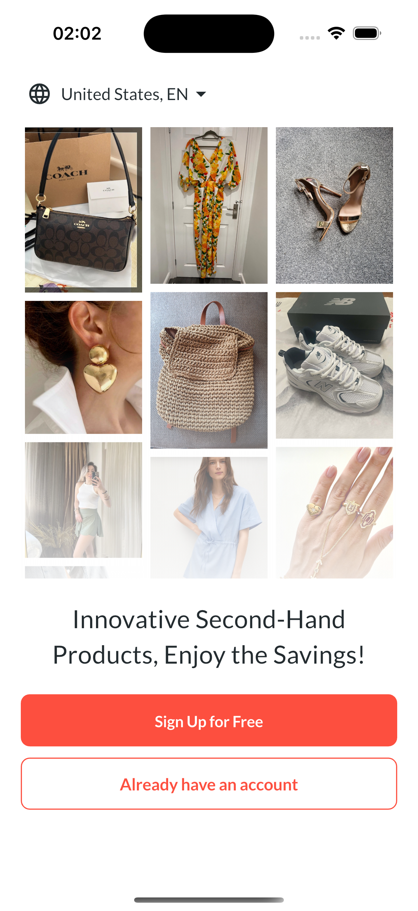

# Getting Started

Oli is a second-hand product listing platform designed to help users buy and sell pre-owned items easily. I decided to share it on GitHub as an open-source resource for anyone interested in building or improving similar platforms.

⚠ This is an incomplete project. Development was halted before all features were fully implemented. However, the existing codebase can serve as a starting point for those looking to create their own marketplace. Feel free to contribute, modify, or use it as inspiration!

## Features

- **User Authentication**

  - Email/Password login and registration
  - Social login integration (Google and Apple Sign-in)
  - Password recovery functionality
  - Username selection

- **Product Management**

  - Category and subcategory organization
  - Brand selection
  - Size and material specifications
  - Price setting with currency support
  - Product listing creation

- **User Profile**

  - Profile customization
  - Avatar management
  - Holiday mode setting
  - Account settings management

- **App Features**
  - Multi-language support
  - Favorites system
  - Search functionality
  - Settings management
  - Help center
  - Privacy policy and terms

## Screenshots

Here are some screenshots showcasing the app's interface:

|        Authentication         |         Main Features         |            Product Management             |
| :---------------------------: | :---------------------------: | :---------------------------------------: |
|  |  |  |
|  |  |  |
|  |  |  |

More screenshots are available in the `img` directory showing various features like account settings, holiday mode, notifications, and the complete selling process.

## Usage

To get started, clone the repository and run `flutter pub get` to install dependencies.

```bash
git clone https://github.com/mertcangorkenn/oli.git
cd oli
flutter pub get
```

Then, run `flutter run` to start the app.

```bash
flutter run
```

## License

This project is released under the [Apache License 2.0](LICENSE)
